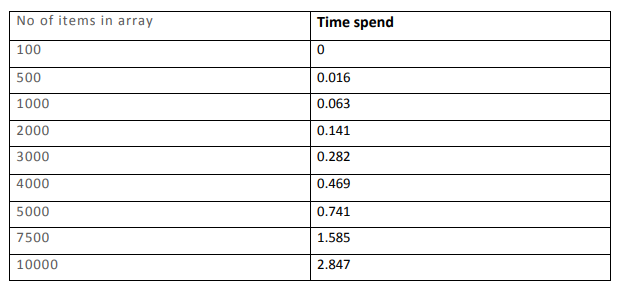
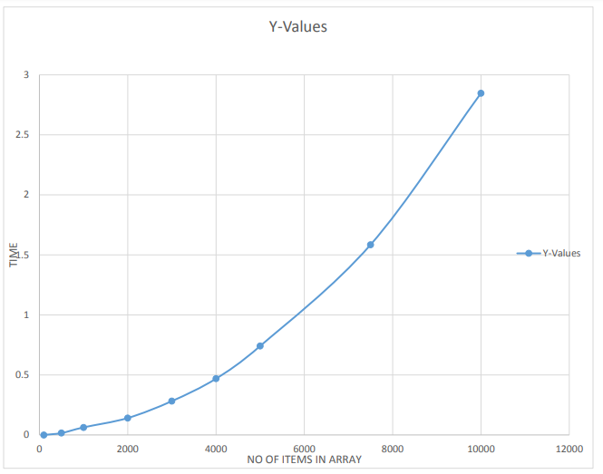
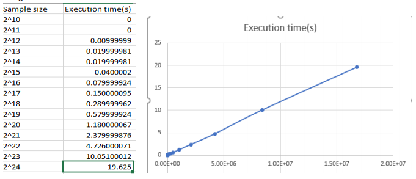

# data-structures-and-algorithms-lab-exercies
This includes the codes and reports that were prepared for the project in the CS2022 data structures and algorithms.
## Lab1 
### Observation

## Lab6
### Observation
#### Algorithm

The strategy used was to build a maxheap of the given list and extract the maximum of the heap k times.
Once a max heap is produced it is certain that within the first k levels of the maxheap the k largest
numbers are present. By considering the previously mentioned fact the maxheap produced was reduced
to k levels (if the number of items present within k levels of a heap is less than the total size of the heap)
before extracting k largest items from the heap. Thus, the algorithm efficiency increases drastically.
TIME COMPLEXITY:

Assume 𝑘 <<< 𝑛 (2^𝑘 < 𝑛) 
Building a MaxHeap – 𝑂(𝑛) 
Reducing the heap to k levels - = ϴ(1) 
Extracting max – 𝑂(lg(2𝑘)) = 𝑂(𝑘). The number elements in k levels of the heap = 2𝑘 − 1 ≈ 2𝑘 
There k such extractions. 
Extracting k largest items = 𝑘𝑂(𝑘) = 𝑂(𝑘2) 
𝑇(𝑛) = 𝑂(𝑛) + 𝑂(𝑘2) + ϴ(1) ≈ 𝑂(𝑛) 

#### Testing

The testing was done using worst case data.(i.e A list where the k largest numbers are at the end). The
sample sizes was doubled each time while keeping k fixed and the time was measured for extracting the
k largest items. 

As shown by the graph the execution time is directly propotional to the sample size which is the same as
predicted by the theoretical analyisis.
